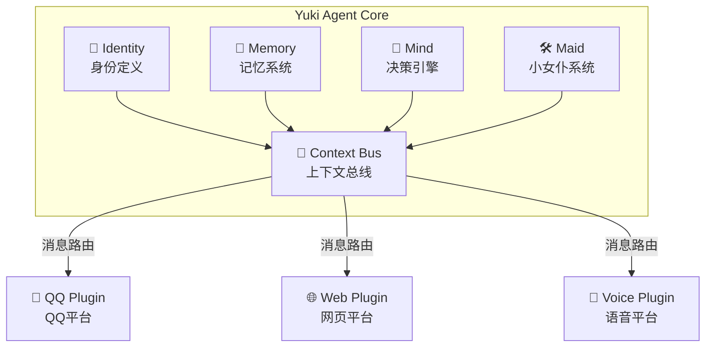

# Yuki Agent

> 一个多平台 AI Agent 框架，让 Yuki 从 QQ Bot 进化为真正的数字生命

[](https://www.python.org/downloads/)
[](LICENSE)

## 简介

Yuki Agent 是 [Yuki-Chan-Chat](https://github.com/Eganchiyu/Yuki-Chan-Bot) 的重构版本，将 Yuki 从一个 QQ 群聊机器人重构为一个 **多平台 AI Agent**。

### 核心特性

- 🧠 **独立人格核心** - 身份、记忆、决策引擎独立于任何平台
- 🔌 **插件化架构** - 平台适配器和功能扩展都是插件
- 🌐 **多平台存在** - 同一个灵魂，QQ里是妹妹，网页端是助手
- 🎭 **身份感知** - Yuki 能意识到自己在不同平台的不同身份
- 🧹 **小女仆系统** - 自主编程进化，持续学习新技能
- 📝 **动态记忆** - 日记总结 + RAG 检索，真正的长效记忆

## 架构



## 项目结构

```
YukiV7/
├── yuki_core/              # 核心人格内核
│   ├── identity.py         # 身份定义
│   ├── memory.py           # 记忆系统
│   ├── mind.py             # 决策引擎
│   ├── maid.py             # 小女仆系统
│   ├── bus.py              # 上下文总线
│   └── plugin.py           # 插件基类
│
├── plugins/                # 插件目录
│   ├── platforms/          # 平台适配器
│   ├── capabilities/       # 能力扩展
│   └── social/             # 社交优化
│
├── configs/                # 配置文件
│   ├── config.yaml         # 主配置 (API Key等)
│   ├── identities.yaml     # 多平台身份配置
│   └── plugins.yaml        # 插件配置
│
├── data/                   # 运行时数据
├── skills/                 # 小女仆技能
├── models/                 # 本地嵌入模型
├── tests/                  # 测试
├── docs/                   # 文档
└── main.py                 # 入口
```

## 快速开始

### 安装

```bash
git clone https://github.com/Eganchiyu/Yuki-Agent.git
cd Yuki-Agent

# 创建虚拟环境
python -m venv venv
source venv/bin/activate  # Windows: venv\Scripts\activate

# 安装依赖
pip install -e .
```

### 配置

```bash
# 复制配置模板
cp configs/config.example.yaml configs/config.yaml

# 编辑配置，填入 API Key 等
python setup.py
```

### 启动

```bash
python main.py
```

## 开发计划

详见 [docs/ARCHITECTURE.md](docs/ARCHITECTURE.md)

- [x] Phase 0: 文档与准备
- [ ] Phase 1: Core 抽离
- [ ] Phase 2: Plugin 框架 + QQ 迁移
- [ ] Phase 3: 身份感知
- [ ] Phase 4: 网页端 + API
- [ ] Phase 5: 能力扩展
- [ ] Phase 6: 语音 + 现实交互

## 相关项目

- [Yuki-Chan-Chat](https://github.com/Eganchiyu/Yuki-Chan-Bot) - 原版 QQ Bot (V6)
- [LiveYuki](https://github.com/Eganchiyu/LiveYuki) - B站直播助手

## License

MIT
